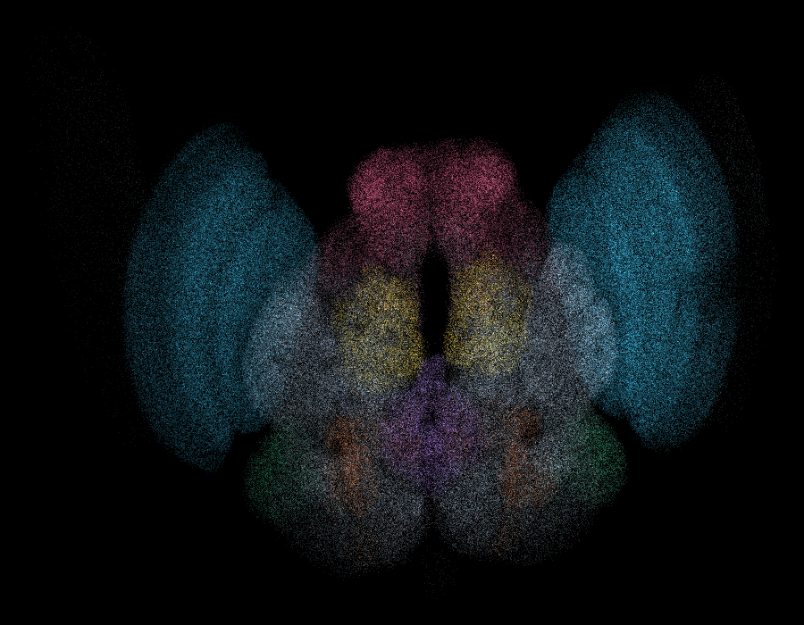
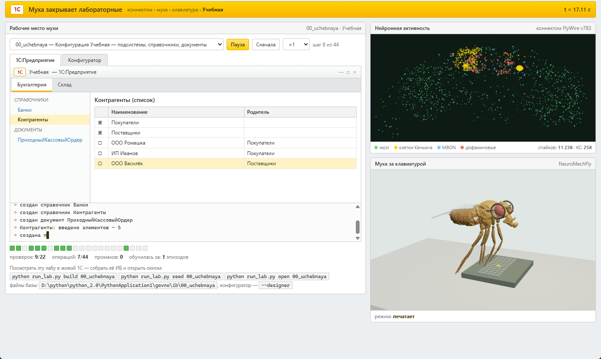
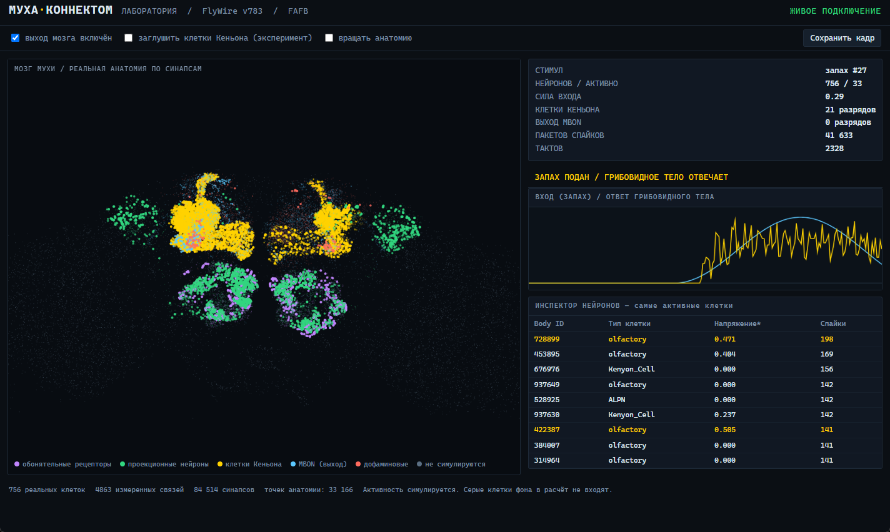

# 🪰 Муха закрывает лабораторные по 1С

> Разработчики подключают оцифрованный мозг дрозофилы ко всему подряд: она поднимала базу
> данных, центровала div, дежурила на проде. Мы решили проверить главное — сдаст ли она
> лабы по 1С:Предприятию. Спойлер: XML-выгрузки грузятся в настоящую информационную базу,
> документы проводятся, `/CheckConfig` отвечает «Ошибок не обнаружено».

Внутри — настоящий коннектом FlyWire (139 255 нейронов, 34 млн синапсов), настоящая модель
тела NeuroMechFly, настоящая платформа 1С в батч-режиме и агент, который читает методичку
в PDF и делает по ней лабораторную. Плюс муха в очках, которая поправляет их лапкой, когда
додумает.



*569 272 синапса из публичного релиза FlyWire, раскраска по отделам мозга: бирюзовые
зрительные доли, малиновые грибовидные тела, жёлтые антеннальные доли, фиолетовый
центральный комплекс. Это не рисунок, это координаты из данных.*

## Как посмотреть за две минуты

```bat
git clone <этот репозиторий>
cd fly1c
pip install -r requirements.txt
python tools/fetch_data.py --light     REM коннектом и меши мухи, ~70 МБ
start.cmd                              REM меню: что открыть
```

`start.cmd` соберёт стартовую страницу `report/home.html` со ссылками на всё и состоянием
стенда. Дальше по вкусу:

| страница | что там |
|---|---|
| `report/stage.html` | **главное**: слева живое окно 1С:Предприятия, справа спайки коннектома и 3D-муха за клавиатурой |
| `report/cinema.html` | муха в студийном свете (думает → поправляет очки → печатает) и объёмный мозг |
| `report/lab.html` | лаборатория: анатомия обонятельной цепи и LIF-симуляция прямо в браузере |
| `report/index.html` | отчёт по всем 12 лабораторным: что сошлось и за сколько эпизодов |

### Таймлапс

▶ **[docs/timelapse.mp4](docs/timelapse.mp4)** — 20 секунд, скорость ×4.

*Муха проходит лабораторную «Мои события №1» с нуля: пустая конфигурация → 28 операций →
16 проверок из 16, промахов ноль. Слева она набирает конфигурацию в 1С, справа в это время
считается коннектом, снизу справа она же сидит за клавиатурой и поправляет очки.*

*Записывается одной командой — `python tools/record.py`. Подробности и другие лабы —
в [docs/README.md](docs/README.md). GitHub не проигрывает mp4 по ссылке из репозитория:
чтобы ролик встроился прямо в страницу, перетащи файл в описание релиза или в issue
и подставь сюда выданный `user-images` адрес.*

### Скриншоты

| сцена: муха работает в 1С | лаборатория коннектома |
|---|---|
|  |  |

*Скриншоты снимаются одной командой — `python tools/screenshot.py` — она открывает страницы
в браузере и кладёт кадры в `docs/`. Рабочий стол при этом должен быть свободен: если поверх
висит полноэкранное приложение, инструмент честно откажется снимать. Вручную — кнопка
«кадр в PNG» на странице или Win+Shift+S. Подробности в [docs/README.md](docs/README.md).*

## Что тут происходит, по-честному

Цепочка целиком:

```
методичка.pdf → требования → пространство ходов → муха выбирает → XML 8.3 → настоящая ИБ 1С
```

1. **PDF → задание.** `fly1c/methodics.py` читает методичку и вытаскивает требования:
   «СерияИНомер (тип Строка, длина -20 символов)» → `String(20)`, «Статус – тип
   СправочникСсылка.СтатусыДрузей» → ссылка на справочник. Из 59 разобранных требований
   53 подтверждены эталонной конфигурацией.
2. **Задание → ходы.** `fly1c/actions.py` строит пространство действий из требований, а не
   из ответа: что создать, чем заполнить, что провести. Туда же подмешаны ловушки —
   реквизит к чужому объекту, движения по чужому регистру, преждевременное проведение.
   Потолок этого пространства — 105 проверок из 113.
3. **Муха выбирает.** `fly1c/policy.py` описывает каждый ход признаками и учится
   подкреплением: +1 за сошедшуюся проверку, −0,5 за мусор в конфигурации.
4. **Результат → 1С.** `fly1c/xml_dump.py` пишет XML формата 8.3, `fly1c/ones_real.py`
   в батч-режиме создаёт ИБ, грузит конфигурацию и гоняет синтаксический контроль,
   `fly1c/seed_bsl.py` генерирует код на встроенном языке, который заполняет справочники
   и проводит документы.

```bat
python run_lab.py build 10_ms_lab1     REM создать ИБ этой лабы
python run_lab.py seed  10_ms_lab1     REM заполнить данными и провести документы
python run_lab.py open  10_ms_lab1     REM открыть окном 1С (--designer — конфигуратор)
```

Все три конфигурации проходят `/CheckConfig` с ответом «Ошибок не обнаружено»:

| ИБ | что внутри после `build` + `seed` |
|---|---|
| `uchebnaya` | 12 элементов справочников, 9 документов |
| `moi_sobytiya` | 20 элементов, 10 документов проведено, 10 записей в регистре |
| `uchet_ds` | 22 элемента, 16 документов проведено, 12 записей в двух регистрах |

## Раздел, где мы сами себя разоблачаем

Честный замер важнее красивой легенды, поэтому: **решает не коннектом.**

В среде с ценой ошибки (жёсткий бюджет шагов, штраф за лишнее в конфигурации) на 12
лабораторных вышло так:

| кто выбирает ходы | счёт |
|---|---|
| случайный выбор из тех же ходов | 89,4 |
| **обучение на признаках** | **100,0** |
| код грибовидного тела (настоящий коннектом) | 75,5 |
| то же с перемешанными связями | 80,0 |
| то же с обнулёнными связями | 93,0 |

Обучение работает: политика обгоняет случайный выбор и переносится на незнакомые
лабораторные — 27 проверок из 30 на пяти лабах, которых не было в обучении. А код
грибовидного тела оказался хуже случайного выбора, и причина измерена: коды для ходов,
отличающихся решающим признаком, совпадают на 63–74%, тогда как у совершенно разных
ходов — на 54%. Представление не различает именно то, от чего зависит правильность.
Пробовали разреженность 5%, 1%, 0,5%, 0,2% и раздельные каналы рецепторов — не помогло.

Поэтому по умолчанию работает `GeneralFly(mode="features")`, а вариант на коннектоме
остался рядом для сравнения — `mode="connectome"`. Коннектом при этом считается
по-настоящему: LIF по 2,7 млн связей, спайки на страницах воспроизводятся до числа.
Но выбор ходов сейчас не на нём, и делать вид, что на нём, мы не будем.

Проверить самому:

```bat
python tools/train_fly.py              REM обучение и замер на незнакомых лабах
python tools/train_fly.py --ablation   REM то же на перемешанном и обнулённом мозге
```

## Как правильно рисовать мозг

Первые попытки давали дым вместо мозга. Грабли и лечение:

| ошибка | как выглядит | чем лечится |
|---|---|---|
| мягкие крупные спрайты | облако тумана | жёсткие точки 1,5–2 px без ореола |
| камера не в той плоскости | мазок вместо силуэта | x вправо, y вверх, глубина по z |
| мало точек | редкие искры | от 300 тысяч; на 26 тысячах структуры нет |
| фиксированная прозрачность | белое пятно | α ≈ 26 / √N |
| цвет только по глубине | красиво, но пусто | цвет по нейропилям |
| щедрый bloom | всё сливается в свечение | сила 0,1–0,15, порог 0,85 |

Цвет берётся из данных: координаты синапсов лежат в `synapse_coordinates.csv.gz`, а
нейропиль контакта — в `connections.csv.gz`; `tools/build_cloud.py` соединяет их по паре
(пресинапс, постсинапс) и раскладывает точки по отделам:

```
зрительные доли      253 135      центральный комплекс   15 873
антеннальные доли     19 026      латеральный рог        12 367
грибовидные тела      16 342      подглоточная зона      48 570
```

Яркость удобнее подбирать офлайн: тот же массив рисуется в PNG за секунду, и сразу видно
пересвет. В браузере перебор параметров занимает в разы больше времени.

## Сборка данных

```bat
python tools/fetch_data.py             REM всё, включая 302 МБ координат синапсов
python tools/build_fly3d.py            REM меши NeuroMechFly -> assets/fly3d.json
python tools/build_circuit.py          REM обонятельная цепь для лаборатории
python tools/build_cloud.py --step 60  REM облако синапсов для студии (~8 минут)

python run_lab.py stage                REM пересобрать сцену
python run_lab.py lab                  REM лабораторию
python run_lab.py cinema               REM студию
python run_lab.py report               REM отчёт
python run_lab.py home                 REM стартовую страницу
```

## Структура

```
fly1c/                ядро
  brain.py            коннектом FlyWire: разреженная матрица и LIF-симуляция
  policy.py           агент: признаки хода, обучение с подкреплением
  actions.py          пространство ходов из задания + ловушки
  methodics.py        разбор методички из PDF
  score.py            оценка с ценой ошибки
  checker.py          проверки: объект есть, тип верный, документ проведён
  ir.py, ops.py       модель конфигурации 1С в памяти
  xml_dump.py         выгрузка в XML формата 8.3
  ones_real.py        батч-режим настоящей 1С
  seed_bsl.py         генерация кода 1С для заполнения данных
  viz_*.py            сцена, лаборатория, студия, отчёт, стартовая страница
tools/                скачивание и сборка данных, обучение
assets/               подготовленные данные (модель мухи, цепь, веса политики)
report/               собранные страницы (в репозиторий не входят)
docs/                 картинки и видео для README
```

## Требования

* Python 3.11+ (проверено на 3.14): numpy, scipy, pypdf, pillow
* Для сборки ИБ — 1С:Предприятие 8.3. Подойдёт **учебная версия**, ей лицензия не нужна.
  Коммерческая платформа без лицензии в батч-режиме не стартует: висит на окне
  «Получение лицензии» и пишет `Не найдена лицензия. Не обнаружен ключ защиты программы`.
  Это не баг проекта.
* Браузер с WebGL. Интернет нужен только на этапе скачивания данных: собранные страницы
  работают офлайн, всё лежит внутри html-файла.

## Лицензии

Код — MIT. Коннектом FlyWire — CC BY 4.0, модель NeuroMechFly — Apache-2.0, three.js — MIT.
Ссылки на статьи и источники — в [ATTRIBUTION.md](ATTRIBUTION.md).

Платформа 1С и методичка вуза в репозиторий не входят.

---

*Ни одна муха при подготовке проекта не пострадала. Лабораторные — пострадали.*
