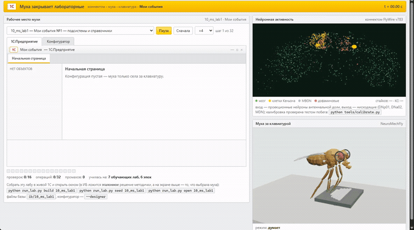

# 🪰 Муха закрывает лабораторные по 1С

> Разработчики подключают оцифрованный мозг дрозофилы ко всему подряд: она поднимала базу
> данных, центровала div, дежурила на проде. Мы решили проверить главное — сдаст ли она
> лабы по 1С:Предприятию. Спойлер: XML-выгрузки грузятся в настоящую информационную базу,
> документы проводятся, `/CheckConfig` отвечает «Ошибок не обнаружено».

Внутри — настоящий коннектом FlyWire (139 255 нейронов, 34 млн синапсов), настоящая модель
тела NeuroMechFly, настоящая платформа 1С в батч-режиме и агент, который читает методичку
в PDF и делает по ней лабораторную. Плюс муха в очках, которая поправляет их лапкой, когда
додумает.


*569 272 синапса из публичного релиза FlyWire, раскраска по отделам мозга: бирюзовые
зрительные доли, малиновые грибовидные тела, жёлтые антеннальные доли, фиолетовый
центральный комплекс. Это не рисунок, это координаты из данных.*

## Как посмотреть за две минуты

```bat
git clone <этот репозиторий>
cd fly1c
pip install -r requirements.txt
python tools/fetch_data.py --light     REM коннектом и меши мухи, ~70 МБ
start.cmd                              REM меню: что открыть
```

`start.cmd` соберёт стартовую страницу `report/home.html` со ссылками на всё и состоянием
стенда. Дальше по вкусу:

| страница | что там |
|---|---|
| `report/stage.html` | **главное**: слева живое окно 1С:Предприятия, справа спайки коннектома и 3D-муха за клавиатурой |
| `report/cinema.html` | муха в студийном свете (думает → поправляет очки → печатает) и объёмный мозг |
| `report/lab.html` | лаборатория: анатомия обонятельной цепи и LIF-симуляция прямо в браузере |
| `report/index.html` | отчёт по всем 12 лабораторным: что сошлось и за сколько эпизодов |

### Таймлапс



*Муха проходит лабораторную «Мои события №1» с нуля. На сцене — не постановка: это тот
самый прогон по полному пространству ходов, с ловушками и ценой ошибки, на котором меряется
качество в таблице ниже. Поэтому в кадре видны и промахи, и то, что сходится не всё.
Слева она набирает конфигурацию в 1С, справа считается коннектом, снизу справа она же
сидит за клавиатурой и поправляет очки.*

Это GIF: GitHub проигрывает его прямо на странице, но он пожат до 9 кадров в секунду.
Исходник в нормальном качестве — [docs/timelapse.mp4](docs/timelapse.mp4), 20 секунд,
1280×766. Записывается одной командой — `python tools/record.py`, GIF собирается из него
же (как — в [docs/README.md](docs/README.md)).

### Скриншоты

| сцена: муха работает в 1С | лаборатория коннектома |
|---|---|
|  |  |

*Скриншоты снимаются одной командой — `python tools/screenshot.py` — она открывает страницы
в браузере и кладёт кадры в `docs/`. Рабочий стол при этом должен быть свободен: если поверх
висит полноэкранное приложение, инструмент честно откажется снимать. Вручную — кнопка
«кадр в PNG» на странице или Win+Shift+S. Подробности в [docs/README.md](docs/README.md).*

## Что тут происходит, по-честному

Цепочка целиком:

```
методичка.pdf → требования → пространство ходов → муха выбирает → XML 8.3 → настоящая ИБ 1С
```

1. **PDF → задание.** `fly1c/methodics.py` читает методичку и вытаскивает требования:
   «СерияИНомер (тип Строка, длина -20 символов)» → `String(20)`, «Статус – тип
   СправочникСсылка.СтатусыДрузей» → ссылка на справочник. Из 59 разобранных требований
   53 подтверждены эталонной конфигурацией.
2. **Задание → ходы.** `fly1c/actions.py` строит пространство действий из требований, а не
   из ответа: что создать, чем заполнить, что провести. Туда же подмешаны ловушки —
   реквизит к чужому объекту, движения по чужому регистру, преждевременное проведение.
   Потолок этого пространства — 105 проверок из 113.
3. **Муха выбирает.** `fly1c/policy.py` описывает каждый ход признаками и учится
   подкреплением: +1 за сошедшуюся проверку, −0,5 за мусор в конфигурации.
4. **Результат → 1С.** `fly1c/xml_dump.py` пишет XML формата 8.3, `fly1c/ones_real.py`
   в батч-режиме создаёт ИБ, грузит конфигурацию и гоняет синтаксический контроль,
   `fly1c/seed_bsl.py` генерирует код на встроенном языке, который заполняет справочники
   и проводит документы.

```bat
python run_lab.py build 10_ms_lab1     REM создать ИБ этой лабы
python run_lab.py seed  10_ms_lab1     REM заполнить данными и провести документы
python run_lab.py open  10_ms_lab1     REM открыть окном 1С (--designer — конфигуратор)
```

Все три конфигурации проходят `/CheckConfig` с ответом «Ошибок не обнаружено»:

| ИБ | что внутри после `build` + `seed` |
|---|---|
| `uchebnaya` | 12 элементов справочников, 9 документов |
| `moi_sobytiya` | 20 элементов, 10 документов проведено, 10 записей в регистре |
| `uchet_ds` | 22 элемента, 16 документов проведено, 12 записей в двух регистрах |

## Схема: как это устроено внутри

Проекты на коннектоме дрозофилы собирают по одной и той же схеме, и здесь она же:

```
состояние лабораторной
  └─ encoder: стимулируем ИМЕНОВАННЫЕ клетки (обонятельные, PAM — награда, PPL1 — наказание)
        └─ граф FlyWire (разреженная матрица) + LIF
              └─ читаем ИМЕНОВАННЫЕ нисходящие нейроны (DNp01 прыжок, DNa02 поворот, MDN назад)
                    └─ decoder: выбор следующей операции в 1С
```

Ключевое: **внутри мозга ничего не обучается.** Веса — это число синапсов из электронной
микроскопии, знак — медиатор нейрона. Учится только маленький декодер снаружи. Адресация
по имени типа клетки живёт в `fly1c/cells.py`, и она настоящая: `DNp01` находится в двух
экземплярах (по одному на сторону), `LC4` — 104, `PAM` — 307.

### Проверка, что симуляция вообще что-то считает

У таких проектов есть канонический тест: стимулируешь детекторы приближающегося объекта
(`LC4`, `LPLC2`) с одной стороны головы — должно разрядиться гигантское волокно `DNp01`
**той же** стороны. Это команда прыжка, самая изученная цепь побега у мухи. Цепь никуда
не закладывалась руками: попадёт сигнал куда надо или нет, решает сам датасет.

```bat
python tools/calibrate.py            REM проверить калибровку
python tools/calibrate.py --sweep    REM перебрать усиление и рефрактерность
```

```
вес   LC4+LPLC2 -> DNp01: своя сторона +1.87, чужая +0.00
спайки гигантского волокна: своя 6, чужая 0, фон без стимула 0
активность мозга: 722 спайков за прогон
ИТОГ: цепь побега работает
```

Этот тест поймал в проекте две настоящие ошибки, и обе были незаметны, пока всё мерилось
только «числа воспроизводятся»:

1. **Знак связи брался с предсказания медиатора на каждом синапсе.** Предсказания там
   шумные: у `LC4` — заведомо холинергического, то есть возбуждающего — больше половины
   синапсов размечены как глутамат. С таким знаком выход `LC4` на гигантское волокно
   получался **тормозным**, и цепь побега не могла сработать в принципе. Правильно брать
   медиатор нейрона (закон Дейла: нейрон выделяет один и тот же медиатор во всех синапсах).
   После починки вес связи стал +6,34 вместо −0,57.
2. **Одно глобальное усиление на весь мозг не годится.** При значении, на котором работала
   цепь побега, клеткам Кеньона приходило максимум 0,66 при пороге 1,0 — грибовидное тело
   не могло разрядиться никогда. При значении для грибовидного тела захлёбывался весь мозг.
   Лечится нормировкой входа: у каждого нейрона сумма модулей входных весов равна единице,
   а силу задаёт один общий `gain`.

Заодно появился рефрактерный период: без него гигантское волокно «стреляло» 38 раз из 40
возможных тактов, хотя в жизни это одиночная команда прыжка.

## Два вопроса, которые задают первыми

**«Нейронная активность ведь ненастоящая?»** Настоящая, и это проверяется одной командой.
Кадр записывается вместе с состоянием задачи, а спайки считаются LIF-моделью по
разреженной матрице коннектома FlyWire — 139 255 нейронов, 2,7 млн связей. Число из
`report/stage.json` воспроизводится из данных бит в бит:

```python
from fly1c.brain import get_brain
b = get_brain()
key = "0" * 16 + "|"                      # состояние проверок в первом кадре
print(int(b.simulate(b.odor(key)).sum()))  # 11606 — ровно то, что на странице
print(int((b.kc_response(key) > 0).sum())) # 258  — клеток Кеньона столько же
```

Точки на панели — не декоративный шум: это выборка настоящих нейронов, разложенная
по их же координатам из датасета, а горит то, что дала симуляция. Оговорка одна и она
важная: LIF — это упрощённая модель мембраны, а не биофизика живой мухи. Считается
настоящий коннектом, но считается он грубо.

**«Муха же не жмёт конкретные клавиши».** Раньше — не жала, вы были правы: подсвечивалась
клавиша по счётчику символов (`typed * 3`), а лапки махали по синусоиде. Теперь клавиатура
настоящая: 47 клавиш с раскладкой ЙЦУКЕН/QWERTY, где кириллица и латиница делят одну
кнопку — как на живом железе. Символ из лога ищет свою клавишу по карте, лапка приводится
к ней инверсной кинематикой по кончику (`Tarsus5`), клавиша проваливается под нажатием.
Двоеточие честно жмётся клавишей «6», скобка — «9».

Проверяется в консоли браузера на странице сцены:

```js
FlyRig.probe('с')   // {label:"с", lat:"c", side:"R", dxy:0, pressed:0.0176}
```

`dxy` — промах кончика лапки мимо центра клавиши. По всем 60 символам, которые
встречаются в логах, он равен 0,000 при шаге клавиш 0,16. Подпись под сценой во время
печати показывает, какая клавиша нажата прямо сейчас, — можно сверять глазами.

## Раздел, где мы сами себя разоблачаем

Здесь два признания, и второе неприятнее первого.

Среда с ценой ошибки: жёсткий бюджет шагов, штраф за лишнее в конфигурации, в
пространстве ходов есть заведомо неверные. 12 лабораторных, 113 проверок. Пять зёрен,
один жадный проход на каждое:

| кто выбирает ходы | проверок из 113 | разброс |
|---|---|---|
| **тот же цикл, выбор наугад** | **103,4** | 100–106 |
| обучение на признаках | 103,2 | 101–105 |
| нисходящие нейроны (канон. схема) | 102,2 | 96–105 |
| нисходящие, связи перемешаны | 93,0 | 90–100 |
| нисходящие, связи обнулены | 102,2 | 99–104 |
| код грибовидного тела | 100,4 | 99–102 |
| грибовидное, связи перемешаны | 102,0 | 100–104 |
| грибовидное, связи обнулены | 102,2 | 99–104 |

**Признание первое: решает не коннектом.** Обнулить все 2,7 млн связей — и счёт не
меняется (102,2 против 102,2). Единственное, что вообще двигает цифру, — перемешанные
связи на нисходящем выходе: 93,0, то есть испорченный мозг активно мешает, тогда как
отсутствующий просто нейтрален. Это говорит, что представление влияет на решение, но
не говорит, что настоящая проводка помогает.

**Признание второе: обучение тоже ничего не даёт.** Тот же цикл решения с нулевыми
весами — то есть выбор наугад среди допустимых ходов — даёт 103,4. Обученная политика
даёт 103,2. На восьми зёрнах: 102,5 против 103,5. Это разница в одну проверку из 113
при разбросе в пять-шесть. Эффекта нет.

Раньше в этом README стояло «обучение работает: 103 против 83». Цифра 83 была получена
на **другом, более слабом цикле**: без отсева уже сделанных и уже провалившихся ходов,
без предела топтания на месте. Сравнивались не политики, а обвязка среды. Строка
«для сравнения: более слабый цикл наугад» в выводе `tools/audit.py` оставлена
специально — чтобы видно было, откуда бралась красивая цифра.

Тогда что закрывает лабораторные? **Среда.** Разбор методички в требования и требований
в пространство ходов: `fly1c/methodics.py` и `fly1c/actions.py`. Потолок этого
пространства — 105 проверок из 113, и почти в него упирается любой выбор, хоть обученный,
хоть случайный. Вся работа сделана на этапе, где задание превращается в конечный список
осмысленных операций, а не на этапе, где из них выбирают.

Что из этого следует для самой идеи «муха закрывает лабы». Симуляция настоящая и
проверяемая: канонический тест побега проходит, спайки воспроизводятся до числа,
и муха действительно печатает по клавишам ровно тот текст, что идёт в 1С. Но
утверждать, что решение принимает коннектом, оснований нет. Мозг здесь честно
считается и честно показывается, а лабораторную закрывает разбор методички.

Все числа пересчитываются одной командой:

```bat
python tools/audit.py                   REM вся таблица, 5 зёрен (около 20 минут)
python tools/audit.py --seeds 2 --quick REM быстро: базис и признаки
python tools/calibrate.py               REM канонический тест цепи побега
```

## Как правильно рисовать мозг

Первые попытки давали дым вместо мозга. Грабли и лечение:

| ошибка | как выглядит | чем лечится |
|---|---|---|
| мягкие крупные спрайты | облако тумана | жёсткие точки 1,5–2 px без ореола |
| камера не в той плоскости | мазок вместо силуэта | x вправо, y вверх, глубина по z |
| мало точек | редкие искры | от 300 тысяч; на 26 тысячах структуры нет |
| фиксированная прозрачность | белое пятно | α ≈ 26 / √N |
| цвет только по глубине | красиво, но пусто | цвет по нейропилям |
| щедрый bloom | всё сливается в свечение | сила 0,1–0,15, порог 0,85 |

Цвет берётся из данных: координаты синапсов лежат в `synapse_coordinates.csv.gz`, а
нейропиль контакта — в `connections.csv.gz`; `tools/build_cloud.py` соединяет их по паре
(пресинапс, постсинапс) и раскладывает точки по отделам:

```
зрительные доли      253 135      центральный комплекс   15 873
антеннальные доли     19 026      латеральный рог        12 367
грибовидные тела      16 342      подглоточная зона      48 570
```

Яркость удобнее подбирать офлайн: тот же массив рисуется в PNG за секунду, и сразу видно
пересвет. В браузере перебор параметров занимает в разы больше времени.

## Сборка данных

```bat
python tools/fetch_data.py             REM всё, включая 302 МБ координат синапсов
python tools/build_fly3d.py            REM меши NeuroMechFly -> assets/fly3d.json
python tools/build_circuit.py          REM обонятельная цепь для лаборатории
python tools/build_cloud.py --step 60  REM облако синапсов для студии (~8 минут)

python run_lab.py stage                REM пересобрать сцену
python run_lab.py lab                  REM лабораторию
python run_lab.py cinema               REM студию
python run_lab.py report               REM отчёт
python run_lab.py home                 REM стартовую страницу
```

## Структура

```
tests/                проверки утверждений из этого README
fly1c/                ядро
  brain.py            коннектом FlyWire: разреженная матрица и LIF-симуляция
  cells.py            адресация по имени типа клетки: LC4, DNp01, PAM, PPL1
  policy.py           агент: признаки хода, обучение с подкреплением
  actions.py          пространство ходов из задания + ловушки
  methodics.py        разбор методички из PDF
  score.py            оценка с ценой ошибки
  checker.py          проверки: объект есть, тип верный, документ проведён
  ir.py, ops.py       модель конфигурации 1С в памяти
  xml_dump.py         выгрузка в XML формата 8.3
  ones_real.py        батч-режим настоящей 1С
  seed_bsl.py         генерация кода 1С для заполнения данных
  stage.py, trace.py  запись настоящего прогона решателя для сцены
  viz_*.py            сцена, лаборатория, студия, отчёт, стартовая страница
tools/                скачивание и сборка данных, обучение, аудит чисел из README
  calibrate.py        канонический тест: looming -> гигантское волокно
assets/               подготовленные данные (модель мухи, обонятельная цепь)
report/               собранные страницы (в репозиторий не входят)
docs/                 картинки и видео для README
```

## Тесты

```bat
python -m pytest tests -q
```

Девять проверок ровно на те утверждения, которыми проект хвастается: коннектом
воспроизводим и действительно большой, методичка разбирается в типы, в пространстве
ходов есть ловушки, лишний объект считается мусором, цепь побега срабатывает,
выгрузка — разбираемый XML. Тесты, которым нужен коннектом, сами пропускаются, если
данные не скачаны.

## Требования

* Python 3.11+ (проверено на 3.14): numpy, scipy, pypdf, pillow
* Для сборки ИБ — 1С:Предприятие 8.3. Подойдёт **учебная версия**, ей лицензия не нужна.
  Коммерческая платформа без лицензии в батч-режиме не стартует: висит на окне
  «Получение лицензии» и пишет `Не найдена лицензия. Не обнаружен ключ защиты программы`.
  Это не баг проекта.
* Браузер с WebGL. Интернет нужен только на этапе скачивания данных: собранные страницы
  работают офлайн, всё лежит внутри html-файла.

## Лицензии

Код — MIT. Коннектом FlyWire — CC BY 4.0, модель NeuroMechFly — Apache-2.0, three.js — MIT.
Ссылки на статьи и источники — в [ATTRIBUTION.md](ATTRIBUTION.md).

Платформа 1С и методичка вуза в репозиторий не входят.

## Честная оговорка

Проводка — настоящая карта синапсов одной конкретной самки дрозофилы, снятая
электронным микроскопом. Спайки, «решения» и то, что на страницах названо «муха думает», —
модель с ручной калибровкой. Живую муху, закрывающую лабораторную по 1С, никто не
записывал. Это не продукт FlyWire, Princeton или Кембриджа и не официальная позиция кого
бы то ни было.

---

*Ни одна муха при подготовке проекта не пострадала. Лабораторные — пострадали.*
